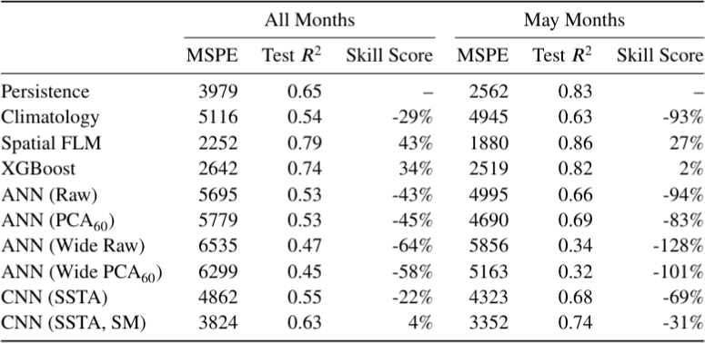
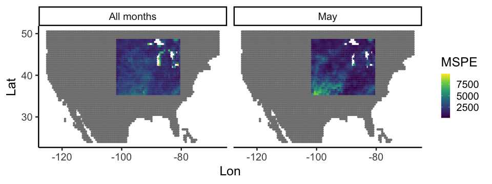
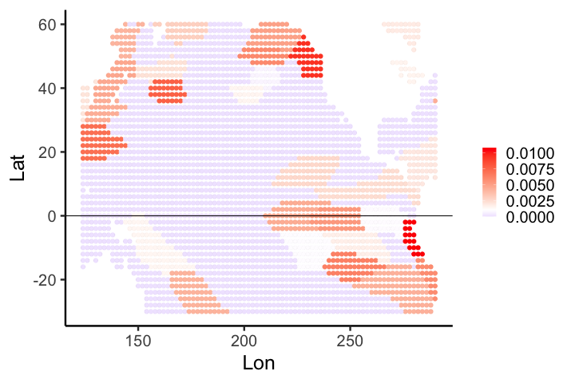
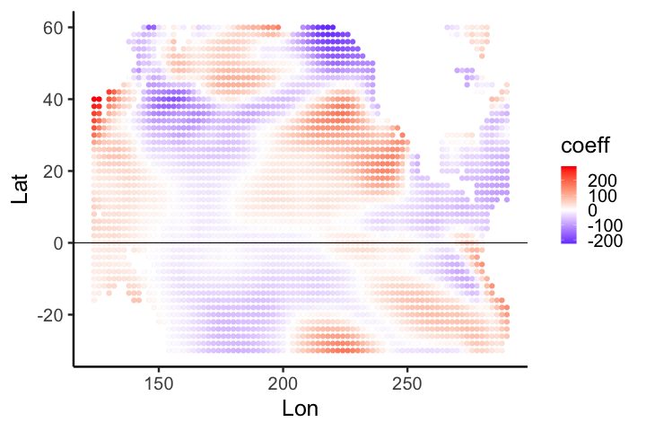
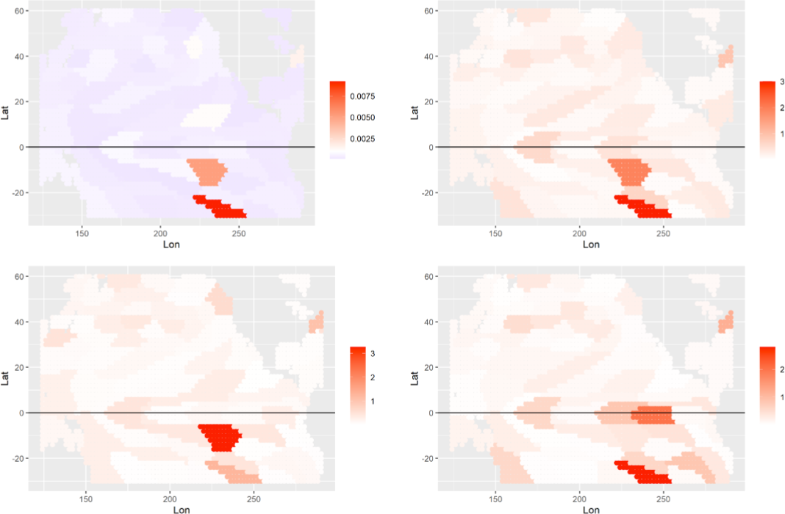
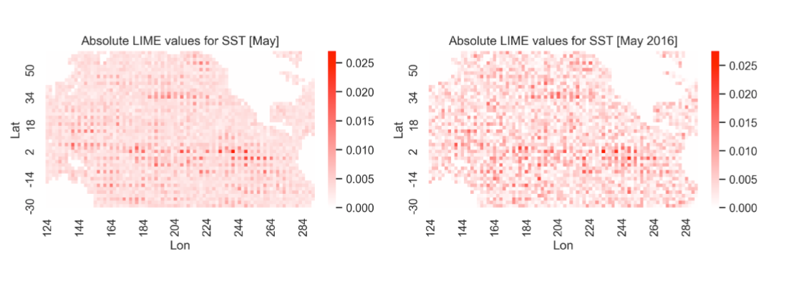

class: inverse

```{r include=FALSE}
library(ggplot2)
filter <- dplyr::filter
knitr::opts_chunk$set(warning=FALSE, message=FALSE, fig.width=10.5, fig.height=4, 
  comment=NA, rows.print=16)
theme_set(theme_gray(base_size = 24))
```

## What are Statisticians Good For?

I like to tell my students that statistics is fundamentally a collaborative 
discipline. We **quantify uncertainty** for the advancement of science. 

---

class: inverse

## And What Do Statisticians Use?

While nonparametric statistics is a vibrant and active area of research, 
on average we're mostly interested in distributions - they're one of our 
fundamental building blocks. 

---

class: inverse

## Machine Learning: The Enemy?

The explosion of scientific development in machine learning and artificial intelligence over the last 30 years, concurrent with the growth in CPU and GPU power to allow for such models to be readily accessible to the average scientist, has resulted in a sea change in statistical studies of the environment. 

<br/>
While technically parametric, in practice ... opaque, black-box methods!
---

class: inverse

## Environmental Data Science & Concerns

The merging of the two fields - environmental statistics and data science - 
has resulted in a new focus: Environmental Data Science, which uses a mixture
of tools from both statistics and machine learning fields to tackle complex,
environmental problems. 

--

<br />

Two primary concerns statisticians have had of the use of machine and deep learning neural network models are:

<br/>

* their lack of both uncertainty quantification
* and inferential potential. 

---

class: inverse

## Explainable AI (xAI)

These two issues are an open area of research, and the development of 
"Explainable AI" and "Interpretable AI" over the last few years 
(2018-23) has aimed to mitigate these concerns. 

<br/>

Our collaborative working group examined the problem of explaining which 
inputs are important, when modelling environmental data - this was a 
TIES working group, after all!

---

class: inverse

## Methods Covered

We focused on three general model-agnostic methods for explainability:

<br/>

* feature shuffling
* interpretable local surrogates (LIME)
* occlusion analysis (Shapley values)

---

class: inverse

## Feature Shuffling

Originally developed for random forests (Breiman, 2001) and neural networks
(Recknagel et al., 1997), under the goal of understanding interactions of variables:
permutations of features to determine importance. 

<br/>

Recently (2019) extended by Aaron Fisher, Cynthia Rudin and Francesca Dominici to a 
general variable importance framework suitable for any input-output model. This
framework focuses on the problem of how much prediction models rely on specific covariates to achieve their accuracy.

---

class: inverse

## Interpretable Local Surrogates 

LIME was developed by Ribeiro et al. (2016) as an technique for
explanation of the predictions of any classifier in an interpretable and
faithful manner -- learning an interpretable model locally around the prediction.

<br/>
This is done by applying perturbations, generating **local** surrogates 
(models which behave like the black-box model in a local sense) and then
using the surrogates to explain the original black-box.


---

class: inverse

## Shapley Values

The last method considered is **old**: the original derivation of Shapley
values was 1953, in the context of game theory and stable allocations. This
method was part of the body of work that led Shapley to receive the 2012 Nobel
Prize in Economics. 

<br/>
These values were adapted to classification of features in regression and
machine learning models in 2001 by Lipovetsky and Conklin, and then developed
further in 2014-2017, including the publication of the `SHAP` package for Python.

---

class: inverse

## Methods Exist: How Well Do They Work?

So methods exist to aide in the interpretion of machine learning models - 
but how well do they work for our environmental statistics problems,
and our traditional interests from such models?

---

class: inverse

## The Test Problem

To explore these methods, and determine their relative usefulness for
environmental data science, we used a classic environmental statistics
problem: **long-lead forecasting of monthly soil moisture in the North American 
"corn belt", using sea surface temperature anomalies in the Pacific Ocean.**

<br/>
Data was available from 1948 to 2021, with 1948-2013 used for training,
while data from 2014-2021 were used to assess model performance

---

class: inverse

## Some Context for the Problem

Successful long-lead forecasts are usually tied to the longer-time scale 
dynamics of the ocean, and the long-distance atmospheric
teleconnections induced by anomalous heating or cooling (ENSO phenomenon)
at the ocean surface.

<br/>
Skillful long-lead forecasts based on statistical models that incorporate this 
relationship are as good as, and typically better than, deterministic
models. Although linear models can be skillful in these settings, nonlinear
statistical methods often perform better than deterministic forecast models 
at least for some spatial regions and lead times.


---

class: inverse

## Models Considered

As the focus is on the explainability, we limited the number of variant models. 
Four variations of ANNs and two of CNNs were considered.

* Persistence Forecast: soil moisture at 3 months lag
* Climatology: average for that month and location across all training
* Spatial Functional Linear Regression: for baseline comparison
* XGBoost: gradient-boosted trees
* Artificial Neural Networks (ANNs): classic neural network models
* Convolutional Neural Networks (CNNs): regularized ANNs - feature extraction

---

class: top

## Model Results (no Explainability)

<center>

</center>

<br/>
Results for All Months forecast, and May only, with persistence as baseline.
---

class: top, inverse

## Spatial Functional Linear Model (Spatial FLM)

* best performance for all models
* tuned based on prior knowledge of problem

<br/>

<center>

</center>

---

class: inverse

## Variable Importance Maps for Spatial FLM

<center>
 &nbsp;

</center>

<br/>
(Left) Model Reliance metric for predicting SM in the months of May -
note the swaths $\leq 0$ - equates to little importance
<br/>
(Right) functional regression coefficients at a sea surface location, 
averaged for all SM locations in the corn belt - note the signs

---

class: inverse

## XGBoost

<center>

</center>

<br/>
(A) gains; (B) absolute Shapley values; (C) May SM for 2016 (an El Niño year); (D) May SM for 2021.


---

class: inverse

## CNNs and LIME

<center>

</center>

<br/>
(A) absolute LIME values averaged across 2014-21; and (B) absolute LIME
values for 2016 alone. 

<br/>
Both for a CNN model applied to the entire sea surface
data as input. 

---

class: inverse

## Some Interpretation of the Interpretability


* explainability approaches feasible, but definitively not trivial

--

* relative performance is an issue: hard to expand on explainability when the model
simply does not fit as well as is possible

--

* It is not surprising that the linear model and the XGBoost models were skillful.
    - We conjecture that the primary limitation here was the relatively small
    training sample 
    
--

* Although these methods tended to find coherent regions in the SSTA features 
that were important for the predictions via explainability, they were
not always in agreement. 


---

class: inverse

## Continued Interpretation

* the explainability metrics did provide suggestions for particular regions
in the SSTA feature space that were important for individual instances

--

* challenges with the interpretability methods

--

    - the explainability methods all have difficulty when there is dependence in the predictors
    
--

    - deep models (e.g., ANNs and CNNs) require the user to
select many different hyperparameters with respect to model architecture -- this affects explainability, but how?

--

    - although the CNN models were not uniformly skillful, they did capture 
    strong ENSO SSTA patterns of importance
    
---

class: inverse

## Key Take-Aways

* proof of concept: explainability can be applied to machine learning models in the 
context of environmental modeling

--

* tuning the models to work well first is more important than explainability - if the model does not work well, who cares what it is doing?

--

* once you have built a working (e.g., reasonably high $R^2$ model), there **are** 
options available to explain what it is doing

--

    - computational burden can be very, very high
    
--

    - need to consider the input space carefully
    
---


class: top, inverse

## Working Group Thoughts

* critical need for early community building

--

* inevitably, some contributors do more

--

* Zoom is sufficient for the 'discussion' part of the collaboration

--

* Zoom is **not** sufficient to replace the heads-together-working-it-out
portion of a collaboration

--

* having someone with more experience and direction is critical

--

* having a really good idea what the desired output is at the start is very important

--

* not a good model for a poorly scoped problem **unless** the team knows each other well already


---

layout: false
class: inverse, middle

<center>
<a href="http://www.trentu.ca/math/"></a> &emsp;&emsp;
<a href="https://creativecommons.org/licenses/by/4.0/"></a>
</center>

## With thanks to all of the collaborators (see <a href="https://onlinelibrary.wiley.com/doi/10.1002/env.2772">our paper</a>).

- Contact me: [Email](mailto:wesleyburr@trentu.ca) or [Twitter](https://twitter.com/wsburr)
- Slides created via the R package [xaringan](https://github.com/yihui/xaringan) by Yihui Xie
- Slides and source at <http://bit.ly/isi2023>
- Code available at <a href="http://github.com/wesleyburr/explainableAI_Environmetrics">GitHub</a>

<br/>

This project was done under The International Environmetrics Society's working
group initiative, launched 2021 (and still ongoing!). 